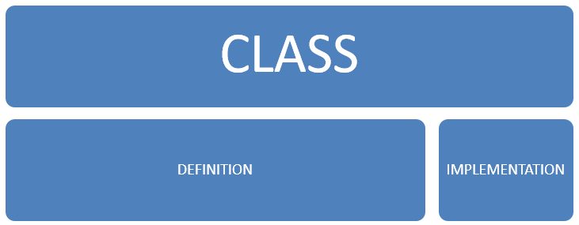

# ABAP-OO

## Forewords
Hello everyone, welcome to ABAP-OO training. I hope you all set for 2 days or more of fun an oriented object programming.
In this training, all the concepts introduced are related to the ABAP-OO programming. This means that some of the concepts introduced are only true in SAP context development.
However, as we enter the paradigm of oriented object programming, for those with some knowledge on it, you'll find a lot of similarities with what other languages are using.
Let's start, shall we ?
## Concepts

### Class
A class is the generic word that will be used to describe the skeletton of an object of the said class.
A class defines **ATTRIBUTES** and **BEHAVIORS**
A set of **VALUATED ATTRIBUTES** defines a **STATE**.
The **BEHAVIOR** _alters/change_ this **STATE**.

See the class as the ***highest level word to describe*** what will be introduced next

Now let's dig deeper into what's beyond that generic word.
An ABAP class is composed of 2 parts.
- Definition 
- Implementation

