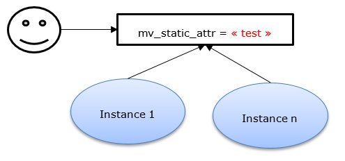
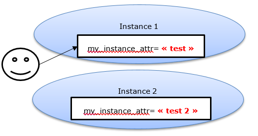
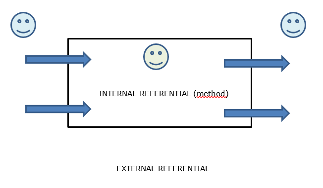

# Attributes (state)

The attributes describe the list of variables that can be valuated in the instance of a class

There are **3** level of attributes
- **INSTANCE** attributes
- **STATIC** attributes
- **CONSTANT** attributes

Instance attributes are defined using **DATA** keyword

Static attributes are defined using **CLASS-DATA** keyword

Constant attributes are defined using **CONSTANTS** keyword

```
CLASS lcl_flight DEFINITION.

  PUBLIC SECTION.

    DATA : mv_plane_number type string.
    CLASS-DATA: mv_nb_of_planes type i.
    CONSTANTS: mv_manufacturer type string value 'Airbus'.

  PRIVATE SECTION.

    DATA : mv_serial_number type string.
    CLASS-DATA: mv_cockpit_firmware type string value 'EPX-123'.
    CONSTANTS: mv_airbus_key type string value 'AIB01'.

ENDCLASS
```

## Properties

- Constant
  -	It exists **ONLY ONCE** for a class
  -	It **shares its value** to every instance of the same class
  -	**Cannot be modified**
 
 
 
- Static
  -	It exists **ONLY ONCE** for a class
  -	It **shares its value** to every instance of the same class
  -	**Can be modified**
  
 
 
- Instance
  -	It exists for every instance of an object of our class **BUT** it doesn't share it's value with other instances
  -	**Can be modified**


   
   - It can be specified that attribute is in **READ-ONLY** mode

```  
DATA : mv_instance_readonly_attr type string value 'Instance attribute read-only' READ-ONLY.
```

## Access

-	Static and constant attributes are accessible through \<class_name\> *=\>* \<class_attribute\>

```
DATA(lv_nb_of_planes) = lcl_flight=>mv_nb_of_planes
DATA(lv_manufacturer) = lcl_flight=>mv_manufacturer
```

-	Instance attributes are accessible through \<reference\> *-\>* \<instance_attribute\>
```
DATA(lv_plane_number) = lo_flight->mv_plane_number
```

# Methods (behavior)

The methods describe the collection of methods that can be used to alter the state of our class or instance itself.

A method has a **SIGNATURE** describe by:
- none to many **IMPORTING** parameters
- none to many **EXPORTING** parameters
- none to many **CHANGING** parameters
- none to **ONE** **RETURNING** parameter
- none to many **EXCEPTIONS**

```
  my_first_method IMPORTING iX_param1 TYPE c [OPTIONAL/DEFAULT]
                  EXPORTING eX_param1 TYPE c
                  CHANGING  cX_param1 TYPE c [OPTIONAL/DEFAULT]
                  RETURNING VALUE( rX_param ) TYPE c
                  EXECPTIONS ex_exception.
```

There are **2** level of methods
- **INSTANCE** method define below keyword **CLASS-METHODS**
- **STATIC** method define below keyword **METHODS**

Please note the **S** at the end of the keyword. It's important to understand that the keyword refers to a **COLLECTION** even if only one method is defined below the keyword.

## Properties

- Static
  -	It can interact only with static attributes.
  - It can be called without any instance 
 
- Instance
  -	It can interact with static attributes **AND** instance attributes
  - It has to be called in relation to an instance

```
CLASS lcl_flight DEFINITION.

  PUBLIC SECTION.

    DATA : mv_plane_number type string.
    CLASS-DATA: mv_nb_of_planes type i.
    CONSTANTS: mv_manufacturer type string value 'Airbus'.

    METHODS:  get_plane_number RETURNING VALUE( rv_plane_number ) TYPE c
               give_name IMPORTING iv_name TYPE c.

    CLASS-METHODS:  change_firmware IMPORTING iv_new_firmware TYPE c,
                    get_number_of_planes RETURNING VALUE(rv_nb_of_planes) TYPE i.

  PRIVATE SECTION.

    DATA : mv_serial_number type string.
    CLASS-DATA: mv_cockpit_firmware type string value 'EPX-123'.
    CONSTANTS: mv_airbus_key type string value 'AIB01'.

ENDCLASS
```
Now we need also to implement these methods, associate a code to it.

This is achieve in the **IMPLEMENTATION SECTION**

```
CLASS lcl_flight IMPLEMENTATION.

  METHOD get_plane_number.
    rv_plane_number = mv_plane_number.
  ENDMETHOD.

  METHOD give_name.
    mv_name = iv_name.
  ENDMETHOD.

  METHOD change_firmware.
    mv_cockpit_firmware = iv_new_firmware.
  ENDMETHOD.
  
  METHOD get_number_of_planes.
    rv_nb_of_planes = mv_nb_of_planes.
  ENDMETHOD.
ENDCLASS
```
## Access
-	Static methods are callable through \<class_name\> *=\>* \<class_method\>

```
lcl_flight=>get_number_of_planes( ).
get_number_of_planes( ). "within the context of an instance or static method
```

-	Instance attributes are callable through \<reference\> *-\>* \<instance_method\>
```
lo_flight->give_name( ).
get_plane_number( ) "within the context of an instance method <=> me->my_first_method( ).
```

# Special methods (constructors)
## Class constructor
### Properties
- Name is **CLASS_CONSTRUCTOR**
- **PUBLIC**
- **NO PARAMETER**
- **UNIQUE** for a class
- **CALLED ONCE** for a L.U.W (local unit of work)
### Advantages

In a performance aspect, this constructor can be used to load (SELECT) only once common/shared data and store them as static data which will be accessible by any instance requiring information (READ TABLE)

## Constructor
### Properties
- Name is **CONSTRUCTOR**
- **PUBLIC**
- takes **IMPORTING** parameters and **EXCEPTIONS**
- **UNIQUE** for a class
- **CALLED AT EACH** reference instanciation
### Advantages
A instance constructor allows to give an initial state to the instance.

## It's all about referential
When you define a method, you define it as follow :
```
  my_first_method IMPORTING iX_param1 TYPE c [OPTIONAL/DEFAULT]
                  EXPORTING eX_param1 TYPE c
                  CHANGING  cX_param1 TYPE c [OPTIONAL/DEFAULT]
                  RETURNING VALUE( rX_param ) TYPE c
                  EXECPTIONS ex_exception.
```
**BUT**
when you call it, you'll use it as follow :
```
  my_first_method EXPORTING iX_param1 
                  IMPORTING eX_param1
                  CHANGING  cX_param1
                  RECEIVING VALUE( rX_param )
                  EXECPTIONS ex_exception.
```
It's all about the referential you're considering. Let's take a look at this little diagram



When the observer is from an external referential, the caller is exporting parameters to the method and then he's importing/receiving results from the method.

But when the observer is inside the method referential, the method is importing parameters from outside and then it's exporting/returning value to the outside
