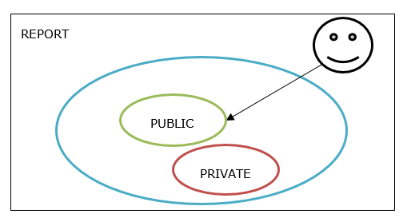
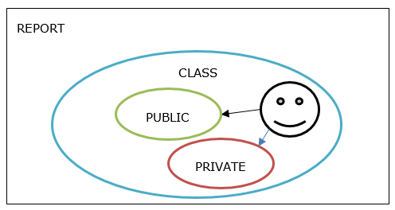
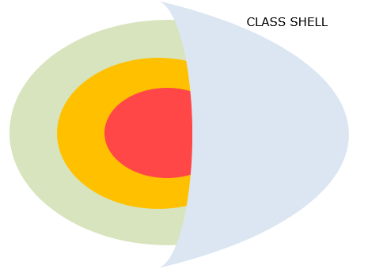

# My first class 

### Class
A class is the generic word that will be used to describe the skeletton of an object of the said class.

A class defines **ATTRIBUTES** and **BEHAVIORS**.

A set of **VALUATED ATTRIBUTES** defines a **STATE**.

The **BEHAVIOR** _alters/change_ this **STATE**.

A **BEHAVIOR** is equivalent to saying **METHOD**. Let's assume that both wording will be used now.

See the class as the ***highest level word to describe*** what will be introduced next

Now let's dig deeper into what's beyond that generic word.

An ABAP class is composed of 2 parts.
- Definition 
- Implementation


### Definition

-	Definition section will be the part where we’ll declare the collection of attributes and behaviors.
-	We will also specify the **VISIBILITY** of each attributes and behaviors.

But now, let's just start slowly and focus on this code.
```
CLASS lcl_flight DEFINITION.


ENDCLASS.
```

Pretty understandable syntax, right ?

Let's take a moment to discuss what it says.

This declares a local class (**L**CL_flight) named lcl_flight. [See naming conventions](NamingConventions.md).

All the code that will be declared between the two keywords **CLASS** and **ENDCLASS** will belongs to LCL_FLIGHT.

### Implementation

- Remember that in definition, we said that it defines the collection of behaviors.
- Defining here only resumes to listing the possible behaviors.
- To give a real body to the behavior, we need to implement it, code it.

**Implementation** is where all the coding is done.

Can you guess the syntax ? Pretty dull, huh ?

```
CLASS lcl_flight IMPLEMENTATION.


ENDCLASS.

```
:computer: Using SE38, create a new report called ZABAPOO_TRAIN_***XXX*** where XXX is your trigramme

- Title : My first ABAP OO report
- Type : Executable report
- Status: Test report

:floppy_disk: ***save***

Write down following code 

```
CLASS lcl_flight DEFINITION.


ENDCLASS.
```

:bulb: ***compile***

:question: Why is it compiling ?

:computer: Now add the implementation section. (no tips this time)

:bulb: ***compile***

And this is all it takes to start a class. Well an empty one, but still, you've created your first class.

## VISIBILITY

Now, the interesting part begins.

Visibility management is the process to defines what will be accessible/visible from outside the context of our class.

In **DEFINITION** part, the user define the visibility: 

### PUBLIC

A public attribute:

-	is addressable ***WHATEVER*** the referential
-	can be changed from outside
- an additional option ***READ-ONLY*** forbid it to be changed from outside

A public method:

-	is usable whatever the calling referential

_Good Practice: To protect attributes from external access, it’s recommended to set them as PRIVATE_

### PRIVATE

A private attribute is visible:

-	is **ONLY** addressable from the class referential

A private method:

-	is **ONLY** usable within the class referential

_Good Practice: It’s recommended to give access only to method giving a result. The internal process shall remain hidden to the external access_

### PROTECTED 

(explained later).

Let's make it visual





How do we write it using in the definition of our class ?

:computer: start to type ***PUBLIC*** and use CTRL + space to get suggestions of auto completion.

Do it again for ***PRIVATE***

:floppy_disk: save then :bulb: compile

Now, your code should look like this

```
CLASS lcl_flight DEFINITION.

PUBLIC SECTION.

PRIVATE SECTION.

ENDCLASS.

CLASS lcl_flight IMPLEMENTATION.

ENDCLASS.
```

What you have typed is the beginning of a ***successful*** **ENCAPSULATION**

### ENCAPSULATION

The encapsulation is based on **hiding the definition of a class** to the other components of the system. 

Thus, these components **cannot speculate on the internal state andd behavior** of an object of this class or of the class it-self.

The class is the **shell enveloping its attributes and behaviors**.

The principle of visibility is **the warranty to hide or show these implementations** and solely **expose what the external components have to interact with**

- :green_book: Public
- :orange_book: Protected
- :closed_book: Private


