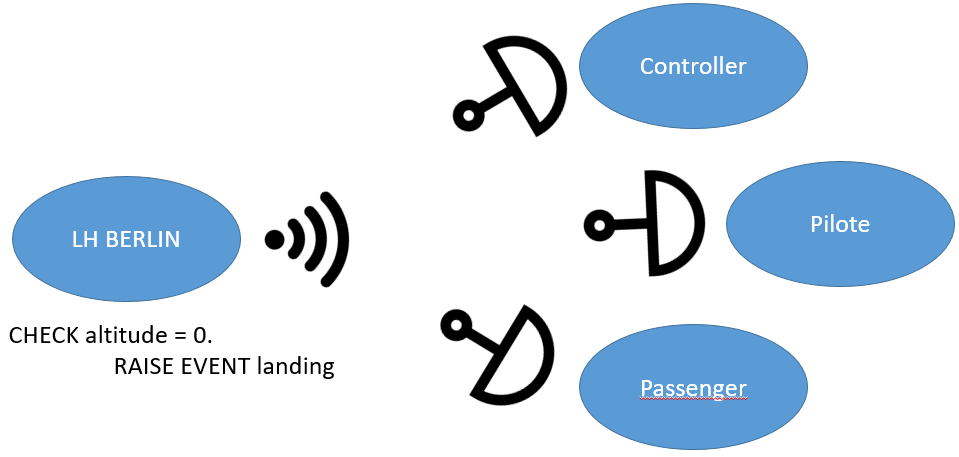
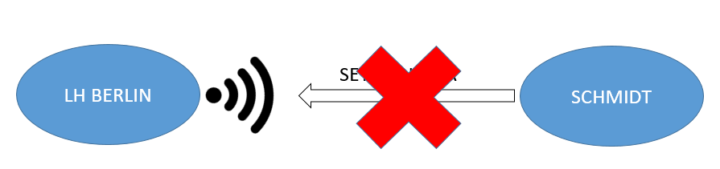
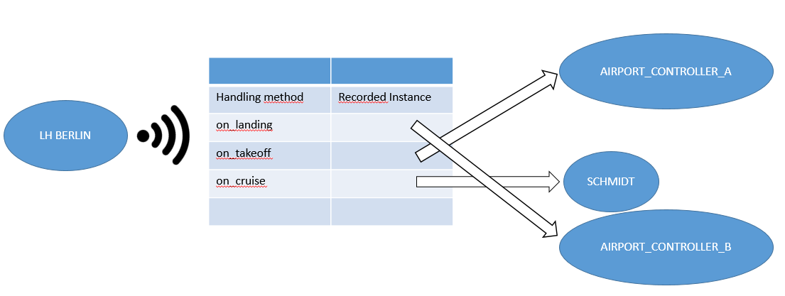

# Events

An **EVENT** may be trigger by an *INSTANCE* or a *CLASS* to announce a change in its state or the reach of a specific state.



In the example above, the "passenger_airplane" instance triggers the "touched_down" event when altitude reaches 0.

Other classes take part in this event and then process it. 

- The air traffic controller indicates on the list that the aircraft has landed.

- The pilot is relieved.

- Mr. Miller switch on its phone.

As you may have anticipate from reading first sentence of this topic, events come in two types:
- **STATIC**
- **INSTANCE**

## Static events

A static event is raised independently of the instance.
Example: Controller send a generic message regarding the traffic condition at the airport

```
CLASS lcl_airport_controller DEFINITION.
	PUBLIC SECTION.
		CLASS-EVENTS: send_weather_notice.

ENDCLASS.
```

## Instance events

An instance event is raised and true only for the instance that raised it.

Example: An aircraft sends the message “Take off”. 

It’s an event true only for the aircraft that raise the event as the others haven’t take off already or have already took off.

```
CLASS lcl_flight DEFINITION.
	PUBLIC SECTION.	
		EVENTS: take_off.
	
ENDCLASS.
```

## Full syntax
```
	(CLASS-)EVENTS: take_off EXPORTING VALUE(ex_name) TYPE name.
```
With this complete syntax, we see that it's possible to send values along with the event


## Trigger an event

```
CLASS lcl_flight DEFINITION.
	PUBLIC SECTION.	
		EVENTS: take_off.
		METHODS : leave_aiport.
ENDCLASS.

CLASS lcl_flight IMPLEMENTATION.
	METHOD leave_aiport.
		RAISE EVENT take_off EXPORTING ex_name = mv_name.  "<= Trigger !
	ENDMETHOD.
ENDCLASS.
```

- The run of the program is hold at the raise
- The treatment of the method of the **listeners** are called and processed
- Then the run of the program continues

If an event handling method triggers an event, the run time is hold again and all event processing methods are executed (nesting).

## Event listeners

In the precedent section, we introduce the event emission with the **RAISE EVENT** keyword.

However, we need to implement _listeners_ to handle the event and execute something related to the event.

In ABAP OO, it comes in 2 steps:
- declare a method **FOR EVENT** OF a class
- declare at runtime **HANDLERS**

Let's see the syntax.

### Method event

```
CLASS lcl_traffic_controller DEFINITION.
	PUBLIC SECTION.
	(CLASS-)METHODS : remove_plane_from_board FOR EVENT take_off OF lcl_flight 
	IMPORTING <ex_name> ... <ex_nameN> (SENDER).
```

Event processing methods are triggered by events (RAISE EVENT), **BUT** they can also be called as normal methods (CALL METHOD).

The signature of the event handling method includes only IMPORTING parameters. 

Only the parameters resulting from the definition of the corresponding event (event interface) can be used. 

In addition to explicitly defined event interface parameters, the **SENDER** default parameter can also be listed as an IMPORTING parameter for instance events. 

A reference is thus passed to the object triggering the event.

### Listeners

```
SET HANDLER <processing_class_name>-><on_event_method> FOR <instance>| FOR ALL INSTANCES [ACTIVATION <var>]
```

You can record an event using 'X' ACTIVATION, and then cancel the handling using ACTIVATION SPACE. 

You can also use a <var> variable with one of these two values. 

If you do not specify a value for ACTIVATION, the event is saved.

#### Activate

```
CLASS lcl_airport_controller DEFINITION.
	PUBLIC SECTION.
		METHODS: add_airplane IMPORTING im_plane TYPE REF TO lcl_airplane.
	PRIVATE SECTION.
		METHODS: on_landing FOR EVENT land OF lcl_flight.
ENDCLASS.


CLASS lcl_airport_controller IMPLEMENTATION.
	METHOD add_airplane.
		SET HANDLER on_landing FOR im_plane ACTIVATION abap_true.
	ENDMETHOD.
ENDCLASS.

```

#### Deactivate


```
CLASS lcl_airport_controller DEFINITION.
	PUBLIC SECTION.
		METHODS: add_airplane IMPORTING im_plane TYPE REF TO lcl_airplane.
	PRIVATE SECTION.
		METHODS: on_landing FOR EVENT land OF lcl_flight.
ENDCLASS.


CLASS lcl_airport_controller IMPLEMENTATION.
	METHOD on_landing.
		SET HANDLER on_landing FOR SENDER ACTIVATION space.
	ENDMETHOD.
ENDCLASS.

```



In the above example, the air controller Schmidt cancels his recording of the landing event for the flight "LH Berlin" once it has landed.

At the next landing of "LH Berlin" (new trigger of landing) will be carried out at another airport and will no longer concern air controller Schmidt.



Each object that has defined events has an internal table: the processing table. 

All objects that have been recorded for events are entered in this table with their event handling methods.

Objects that are saved for an always "active" event will also remain "active". 

The methods of these objects are called when the event is triggered, even if they are no longer accessible via the main memory references.

## Events and visibility

### Event visibility
The visibility of an event establishes permission for its processing :
- both internal and external permission
- only internal to that class or its subclasses permission
- only internal to that class permission

### Handler visibility
The visibility in an event handling method establishes authorization for SET-HANDLER statements. 

They may be used at any point in this class and its subclasses only in this class.

An event handling method **must have the same or less visibility than the event to which it refers.**

- _EVENT_
	- PUBLIC
		- _HANDLERS_
			- PUBLIC,PROTECTED,PRIVATE
	- PROTECTED
		- _HANDLERS_
			- PROTECTED,PRIVATE
	- PRIVATE
		- _HANDLERS_
			- PRIVATE
