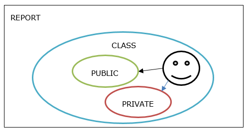

# My first class 

:computer: Using SE38, create a new report called ZABAPOO_TRAIN_***XXX*** where XXX is your trigramme

- Title : My first ABAP OO report
- Type : Executable report
- Status: Test report

:floppy_disk: ***save***

Write down following code 

```
CLASS lcl_flight DEFINITION.


ENDCLASS.
```

:bulb: ***compile***

:question: Why is it compiling ?

:computer: Now add the implementation section. (no tips this time)

:bulb: ***compile***

And this is all it takes to start a class. Well an empty one, but still, you've created your first class.

**VISIBILITY**

Now, the interesting part begins.

Visibility management is the process to defines what will be accessible/visible from outside the context of our class.

In **DEFINITION** part, the user define the visibility: 

-	***PUBLIC***

A public attribute:

-	is addressable ***WHATEVER*** the referential
-	can be changed from outside
- an additional option ***READ-ONLY*** forbid it to be changed from outside

A public method:

-	is usable whatever the calling referential

_Good Practice: To protect attributes from external access, it’s recommended to set them as PRIVATE_

-	***PRIVATE***

A private attribute is visible:

-	is **ONLY** addressable from the class referential

A private method:

-	is **ONLY** usable within the class referential

_Good Practice: It’s recommended to give access only to method giving a result. The internal process shall remain hidden to the external access_

-	***PROTECTED*** (explained later).

Let's make it visual




How do we write it using in the definition of our class ?

:computer: start to type ***PUBLIC*** and use CTRL + space to get suggestions of auto completion.

Do it again for ***PRIVATE***

:floppy_disk: save then :bulb: compile

Now, your code should look like this

```
CLASS lcl_flight DEFINITION.

PUBLIC SECTION.

PRIVATE SECTION.

ENDCLASS.

CLASS lcl_flight IMPLEMENTATION.

ENDCLASS.
