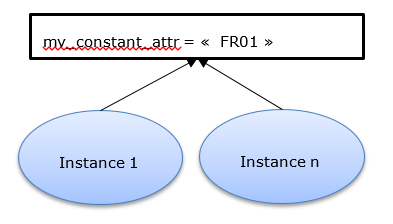
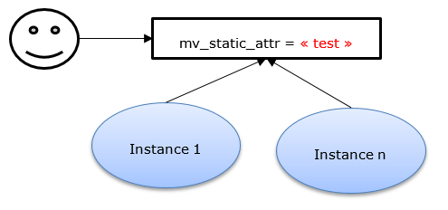
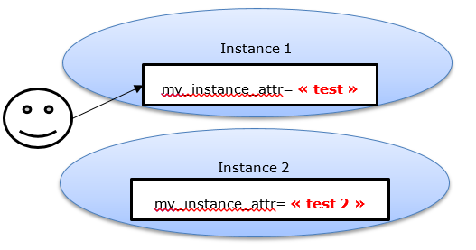

# Attributes (state)

The attributes describe the list of variables that can be valuated in the instance of a class

There are **3** level of attributes
- **INSTANCE** attributes
- **STATIC** attributes
- **CONSTANT** attributes

Instance attributes are defined using **DATA** keyword

Static attributes are defined using **CLASS-DATA** keyword

Constant attributes are defined using **CONSTANTS** keyword

```
CLASS lcl_flight DEFINITION.

  PUBLIC SECTION.

    DATA : mv_instance_attr type string value 'Instance attribute'.
    CLASS-DATA: mv_static_attr type string value 'Static attribute'.
    CONSTANTS: mv_constant_attr type string value 'Constant attribute'.

  PRIVATE SECTION.

    DATA : mv_instance_attr2 type string value 'Instance attribute 2'.
    CLASS-DATA: mv_static_attr2 type string value 'Static attribute 2'.
    CONSTANTS: mv_constant_attr2 type string value 'Constant attribute 2'.

ENDCLASS
```

## Properties

- Constant
  -	It exists **ONLY ONCE** for a class
  -	It **shares its value** to every instance of the same class
  -	**Cannot be modified**
 
 
 
- Static
  -	It exists **ONLY ONCE** for a class
  -	It **shares its value** to every instance of the same class
  -	**Can be modified**
  
 
 
- Instance
  -	It exists for every instance of an object of our class **BUT** it doesn't share it's value with other instances
  -	**Can be modified**


   
   - It can be specified that attribute is in **READ-ONLY** mode

```  
DATA : mv_instance_readonly_attr type string value 'Instance attribute read-only' READ-ONLY.
```

## Access

-	Static and constant attributes are accessible through \<class_name\> *=\>* \<class_attribute\>

```
DATA(lv_static_attr) = lcl_flight=>mv_static_attr
DATA(lv_constant_attr) = lcl_flight=>mv_constant_attr
```

-	Instance attributes are accessible through \<reference\> *-\>* \<instance_attribute\>
```
DATA(lv_instance_attr) = lo_flight->mv_instance_attr
```

# Methods (behavior)

The methods describe the collection of methods that can be used to alter the state of our class or instance itself.

A method has a **SIGNATURE** describe by:
- none to many **IMPORTING** parameters
- none to many **EXPORTING** parameters
- none to many **CHANGING** parameters
- none to **ONE** **RETURNING** parameter
- none to many **EXCEPTIONS**

```
  my_first_method IMPORTING iX_param1 TYPE c [OPTIONAL/DEFAULT]
                  EXPORTING eX_param1 TYPE c
                  CHANGING  cX_param1 TYPE c [OPTIONAL/DEFAULT]
                  RETURNING VALUE( rX_param ) TYPE c
                  EXECPTIONS ex_exception.
```

There are **2** level of methods
- **INSTANCE** method define below keyword **CLASS-METHODS**
- **STATIC** method define below keyword **METHODS**

Please note the **S** at the end of the keyword. It's important to understand that the keyword refers to a **COLLECTION** even if only one method is defined below the keyword.

## Properties

- Static
  -	It can interact only with static attributes.
  - It can be called without any instance 
 
- Instance
  -	It can interact with static attributes **AND** instance attributes
  - It has to be called in relation to an instance

```
CLASS lcl_flight DEFINITION.

  PUBLIC SECTION.

    DATA : mv_instance_attr type string value 'Instance attribute'.
    CLASS-DATA: mv_static_attr type string value 'Static attribute'.
    CONSTANTS: mv_constant_attr type string value 'Constant attribute'.

    METHODS:  my_first_method IMPORTING iX_param1 TYPE c [OPTIONAL/DEFAULT]
                      EXPORTING eX_param1 TYPE c
                      CHANGING  cX_param1 TYPE c [OPTIONAL/DEFAULT]
                      RETURNING VALUE( rX_param ) TYPE c
                      EXECPTIONS ex_exception,
               my_second_method IMPORTING iX_param1 TYPE c [OPTIONAL/DEFAULT]
                      EXPORTING eX_param1 TYPE c
                      CHANGING  cX_param1 TYPE c [OPTIONAL/DEFAULT]
                      RETURNING VALUE( rX_param ) TYPE c
                      EXECPTIONS ex_exception.

    CLASS-METHODS:  my_static_method IMPORTING iX_param1 TYPE c [OPTIONAL/DEFAULT]
                      EXPORTING eX_param1 TYPE c
                      CHANGING  cX_param1 TYPE c [OPTIONAL/DEFAULT]
                      RETURNING VALUE( rX_param ) TYPE c
                      EXECPTIONS ex_exception.               

  PRIVATE SECTION.

    DATA : mv_instance_attr2 type string value 'Instance attribute 2'.
    CLASS-DATA: mv_static_attr2 type string value 'Static attribute 2'.
    CONSTANTS: mv_constant_attr2 type string value 'Constant attribute 2'.

ENDCLASS
```
Now we need also to implement these methods, associate a code to it.

This is achieve in the **IMPLEMENTATION SECTION**

```
CLASS lcl_flight DEFINITION.

  METHOD my_first_method.
  WRITE:/ "Hello World".
  ENDMETHOD.

  METHOD my_second_method.
  WRITE:/ "I'm Groot".
  ENDMETHOD.

  METHOD my_static_method.
  WRITE:/ "I'm static".
  ENDMETHOD.

ENDCLASS
```
## Access
-	Static methods are callable through \<class_name\> *=\>* \<class_method\>

```
lcl_flight=>my_static_method( ).
my_static_method( ). "within the context of an instance or static method
```

-	Instance attributes are callable through \<reference\> *-\>* \<instance_method\>
```
lo_flight->mv_first_method( ).
mv_first_method( ) "within the context of an instance method <=> me->my_first_method( ).
```

# Special methods (constructors)
