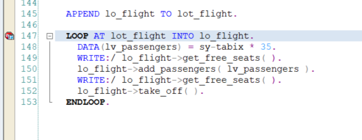
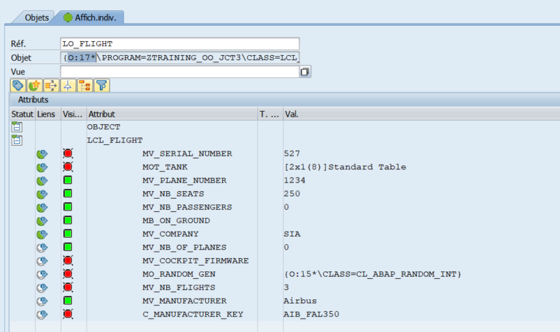
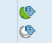
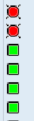
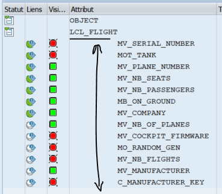
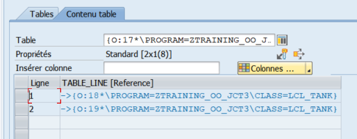
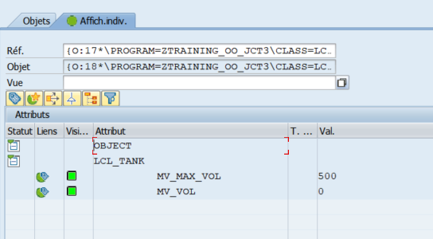

# Enriching our class with tanks

Let's create above current LCL_FLIGHT class, the following class
```
CLASS LCL_TANK DEFINITION.
	PUBLIC SECTION.
		DATA : mv_max_vol TYPE i,
			   mv_vol TYPE i.
         METHODS: get_fuel_level RETURNING VALUE(rv_level) TYPE f,
         constructor
         IMPORTING iv_width  TYPE i DEFAULT 10 "m
                   iv_length TYPE i DEFAULT 10 "m
                   iv_depth  TYPE i DEFAULT 5, "m
				 fill_tank,
		   get_weight RETURNING VALUE(rv_weight) type i.
ENDCLASS.

CLASS LCL_TANK IMPLEMENTATION.
	METHOD constructor.
		mv_max_vol = iv_width * iv_length * iv_depth. "m3
	ENDMETHOD.
	METHOD get_fuel_level.
		rv_level = ( mv_vol / mv_max_vol ) * 95.
	ENDMETHOD.
	METHOD fill_tank.
		mv_vol = mv_max_vol.
	ENDMETHOD.
	METHOD get_weight.
		rv_weight = mv_max_vol * 800 "volumic mass of kerosene
	ENDMETHOD.
ENDCLASS.
```

Now, let's add 2 tanks to our class lcl_flight.

```
CLASS LCL_FLIGHT DEFINITION.
	PRIVATE SECTION.
		DATA : mot_tank TYPE TABLE OF REF TO lcl_tank.
ENDCLASS.

CLASS LCL_FLIGHT IMPLEMENTATION.
	METHOD constructor.
		[...]
		"1st tank
		DATA(lo_tank) = NEW lcl_tank( ).
		APPEND lo_tank TO mot_tank.
		"2nd tank
		lo_tank = NEW lcl_tank( ).
		APPEND lo_tank TO mot_tank.
	ENDMETHOD.
ENDCLASS.
```
:question: How do you call the principle of separate concern into different classes ?

Now set a break point in your report



Double click on lo_flight and again in the variable panel, double click on it. You should see something like this.



Let's take a moment to explain it all.

First you can see the instance icons information. Place your cursor on it and see the tooltip.

The grey icon is for static attributes => declared using CLASS-DATA

The green icon is for instance attributes => declared using DATA



Then you have the visibility icons. Again place your cursor on it.



The red icon is for private attributes => declared in PRIVATE SECTION.

The green icon is for public attributes => declared in PUBLIC SECTION

Now look at the identation in the overview of attributes inside class LCL_FLIGHT



It means that all attributes we see there belongs to LCL_FLIGHT. 

Now, we only have a main class without inheritance but later, it will have its utility.

Finally, if you double click on ```MOT_TANKS```

You'll see what we have declared, meaning a table of references (pointers)



Choose one and double click on it and it'll take you to the actual instance and displays its state



That's it for exercice3.

Now you should know :
- how to use delegation
- how to use debugger and its icons to investigate further into your instance
