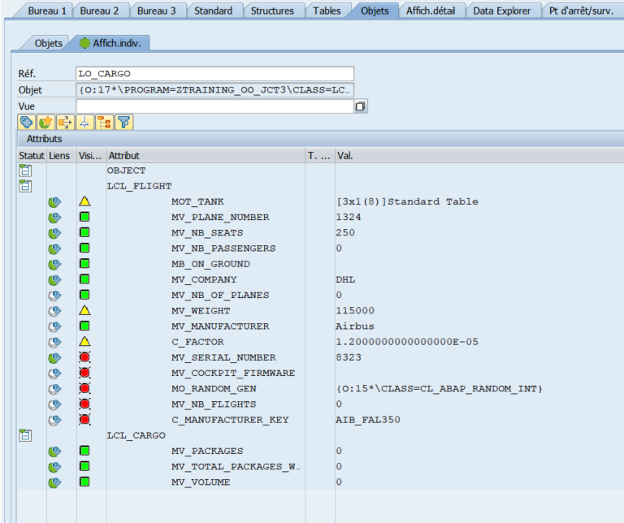

# Our class is becoming a mother of two

Let's add some new behaviors to our root class to start

```
CLASS LCL_FLIGHT DEFINITION.

	PUBLIC SECTION.
	[...]
	METHODS: estimate_fuel_consumption IMPORTING iv_distance TYPE i RETURNING VALUE(re_fuel) type f.	
	PROTECTED.
	
	CLASS-DATA : mv_weight type i.
	CONSTANTS: c_factor type f value '0.000012'.
	
ENDCLASS.
```

```
CLASS LCL_FLIGHT IMPLEMENTATION.
	METHOD class_constructor.
		[...]
		mv_weight = 115000. "weight of A350Neo w/o kerosene (in kg)
	ENDMETHOD.
	METHOD estimate_fuel_consumption.
		DATA lv_total_weight type i.
		LOOP AT mot_tanks INTO DATA(lo_tank).
    			DATA(lv_tank_weight) = lo_tank->get_weight( ).
      			ADD lv_tank_weight TO lv_total_weight.
		ENDLOOP.
		ADD mv_weight TO lv_total_weight.
		re_fuel = ceil( lv_total_weight * iv_distance * c_factor ).
	ENDMETHOD.
ENDCLASS.
```
Replace your current loop in the report with this

```
LOOP AT lot_flight INTO lo_flight.
    DATA(lv_passengers) = sy-tabix * 35.
    WRITE:/ lo_flight->get_free_seats( ).
    lo_flight->add_passengers( lv_passengers ).
    WRITE:/ lo_flight->get_free_seats( ).
    lo_flight->take_off( ).
    WRITE:/ lo_flight->estimate_fuel_consumption( iv_distance = 1000 ).
ENDLOOP.
```
:bulb: compile and run it.

What's the result ?

## First daughter : LCL_CARGO

```
CLASS LCL_CARGO DEFINITION INHERITING FROM LCL_FLIGHT.
		PUBLIC SECTION.
		DATA : mv_packages type i,
			   mv_total_packages_weight type i,
			   mv_company type string.
ENDCLASS.
```
:bulb: compile.

:question: what's the error ? Why ? 

Change the code accordingly and remove ```mv_company``` from ```LCL_CARGO``` has it's already declared

## Second daughter : LCL_AIRPLANE

```
CLASS LCL_AIRPLANE DEFINITION INHERITING FROM LCL_FLIGHT.
		PUBLIC SECTION.
		DATA :	mv_passengers type i,
			mv_luggages   type i,
			mv_airline	type string.
		CONSTANTS : c_avg_weight type i value 75,
    c_avg_lugg_weight type i value 22.
ENDCLASS.
```

## Growing their own characters

```
CLASS LCL_CARGO DEFINITION INHERITING FROM LCL_FLIGHT.
	PUBLIC SECTION.
	    METHODS : constructor IMPORTING iv_plane_number type string iv_company TYPE string,
				  add_package IMPORTING iv_volume TYPE i
          iv_weight TYPE i,
				  estimate_fuel_consumption REDEFINITION.
ENDCLASS.

CLASS LCL_CARGO IMPLEMENTATION.

	METHOD constructor.
		    super->constructor(
		      EXPORTING
			iv_plane_number = iv_plane_number
			iv_company      = iv_company     
		    ).
		mv_company = iv_company.
		DATA(lo_extra_tank) = NEW lcl_tank( ).
		APPEND lo_extra_tank TO mot_tank.
	ENDMETHOD.
	
	METHOD estimate_fuel_consumption.
		DATA lv_total_weight type i.
		LOOP AT mot_tanks INTO DATA(lo_tank).
		      DATA(lv_tank_weight) = lo_tank->get_weight( ).
		      ADD lv_tank_weight TO lv_total_weight.
		ENDLOOP.
		ADD iv_weight TO mv_total_packages_weight.
		ADD mv_weight TO lv_total_weight.
		re_fuel = ceil( lv_total_weight * iv_distance * c_factor ).
	ENDMETHOD.
	  METHOD add_package.
    		ADD iv_volume TO mv_volume.
    		ADD iv_weight TO mv_pack_weight.
 	 ENDMETHOD.

ENDCLASS.

```

:question: Did you notice the super-> namespace used in the constructor of the subclass?
What is its utility ?

:question: Are you able to compile ? Why ?

It's one of the advantages of OO. The compiler is less permissive as when we code a function module and try to call it.

Thus it catch issues at compiling time instead of at runtime.

Change the type of ```iv_airplane_number``` at ```constructor``` of ```LCL_CARGO``` to i.

:question: Are you able to compile ? Why ?

Indeed, private visibility restrict the visibility of the attribute even to class that inherit.

Let's fix this and move ```mot_tank``` to the dedicated section => PROTECTED SECTION.

Now it should be all good.

Write the following code at the end of your report
```
  DATA(lo_cargo) = NEW lcl_cargo(
      iv_plane_number = 1324
      iv_company      = 'DHL'
  ).
```
And enter into lo_cargo using debug mode.

What changes do you notice ?



Now from ```LCL_FLIGHT``` remove method ```add_passengers``` to declare it in ```LCL_AIRPLANE``` instead
```
CLASS LCL_AIRPLANE DEFINITION INHERITING FROM LCL_FLIGHT.
    PUBLIC SECTION.
        METHODS : constructor IMPORTING iv_plane_number TYPE i iv_airline TYPE string,
	add_passengers IMPORTING iv_passengers TYPE i 
	iv_luggages 	TYPE i,
	estimate_fuel_consumption REDEFINITION.
ENDCLASS.

CLASS LCL_AIRPLANE IMPLEMENTATION.
    METHOD constructor.
        mv_airline = iv_airline.
	super->constructor(
	    EXPORTING
		iv_plane_number = iv_plane_number
		iv_company      = iv_airline
	    ).
    ENDMETHOD.
	
    METHOD estimate_fuel_consumption.
	    DATA lv_total_weight TYPE i.
	    LOOP AT mot_tank INTO DATA(lo_tank).
	      DATA(lv_tank_weight) = lo_tank->get_weight( ).
	      ADD lv_tank_weight TO lv_total_weight.
	    ENDLOOP.
	    ADD mv_weight TO lv_total_weight.
	    DATA(lv_pass_n_lugg_weight) = mv_passengers * c_avg_weight + mv_luggages * c_avg_lugg_weight.
	    ADD lv_pass_n_lugg_weight TO lv_total_weight.
	    re_fuel = ceil( lv_total_weight * iv_distance * c_factor ).
    ENDMETHOD.	
    METHOD add_passengers.
         ADD  iv_passengers TO mv_passengers .
	 ADD  iv_passengers TO mv_luggages.
    ENDMETHOD.
ENDCLASS.
```

:question: Does it compile now ? Why ?

Right, let's invert super->constructor and extra declaration.
```
	METHOD constructor.	
		super->constuctor [...]	  "↑
		mv_airline = iv_airline.  "↓
	ENDMETHODS.
```
Now you know that inside a constructor, the super->constructor shall **ALWAYS** be called first.
