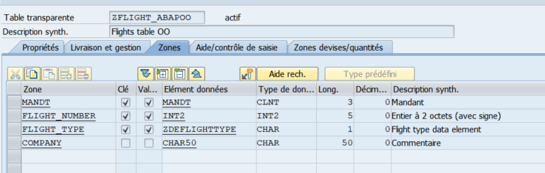

# Using static and dynamic type together

For the sake of the demonstration, I have created a ZTable as follow and I have populated it with values



The data element ZDEFLIGHTTYPE is based on a domain with 2 values A for airplane passengers and C for airplane cargo.

Let's use it in our report. Again, you can comment the previous code.

Let's start by changing the type of iv_plane_number in our class definition.

It was ```i```, and we will change it for ```int2``` to avoid issue.

Change also ```iv_company``` and ```iv_airline``` type into ```any```

Now write this below the commented code.

```
DATA : lv_dynamic_type type string,
       lo_flight type ref to lcl_flight,
       lot_flights type table of ref to lcl_flight.

SELECT * FROM ZFLIGHT_ABAPOO INTO TABLE @DATA(lt_flights).

LOOP AT lt_flights INTO DATA(ls_flight).

  CASE ls_flight-flight_type.
  
    WHEN 'A'.
        CREATE OBJECT lo_flight TYPE lcl_airplane
        EXPORTING
        iv_plane_number =  ls_flight-flight_number
        iv_airline      =  ls_flight-company.
    WHEN 'C'.
        CREATE OBJECT lo_flight TYPE lcl_cargo
        EXPORTING
        iv_plane_number =  ls_flight-flight_number
        iv_company      =  ls_flight-company.
    WHEN OTHERS.
    
 ENDCASE.
 
 APPEND lo_flight TO lot_flights.
      
ENDLOOP.

LOOP AT lot_flights INTO lo_flight.
    WRITE:/ lo_flight->estimate_fuel_consumption( 15000 ).
ENDLOOP.
```

With this example, you see now that we can have a whole set of flights of different types in a single table.

And they will react differently to behavior calls if they implement it differently.

Did you notice the syntax we used ? CREATE OBJECT <instance> TYPE <dynamic instance type>.

Well at this point, it's up to you to decide wether you'll instanciate using the statement CREATE OBJECT or the new syntax
lo_cargo = NEW lcl_cargo( ).

