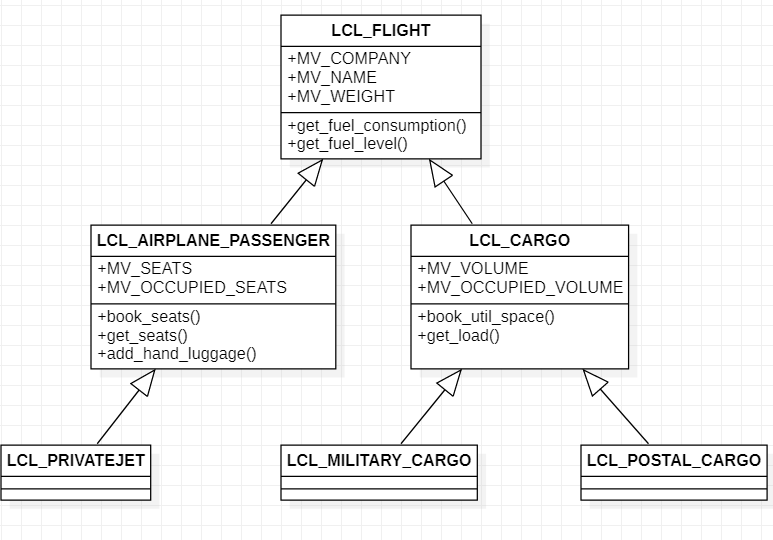

# Inheritance

Inheritance is a relation in which a class (the sub-class) is **inheriting** every characteristics of another class (super-class). 

The sub-class can also **add new features** (attributes, methods, events (to be introduce later) ) and **may replace the inherited method by its own implementation.**

Inheritance can be view as a **link of similarity** between classes. In the below example, the similarities of **passenger airplane** and **cargo airplane** are inherited from the **SUPER-CLASS** lcl_airplane, and so on.



## Specialisation/Generalization

Doing inheritance, the behavior of a class is getting more and more specific.

Rule of :thumbsup: : **A sub-class is a SPECIALIZATION of the behavior and state of the super-class**
The reverse way is called **GENERALIZATION**. As you move to the top, you're moving to a more generic behavior and state.

Rule of :thumbsup: in SAP: **There a no multiple inheritance**. A sub-class cannot inherit from 2 classes directly.

The relation between class and sub-classes is **ONE-WAY**. A sub-class knows its superclass(es) but the super-class doesn't know its sub-class(es).

## Syntax

```
CLASS lcl_flight DEFINITION.

  PUBLIC SECTION.
    METHODS: get_fuel_level RETURNING VALUE(rv_level) TYPE I.
    
ENDCLASS.
[...]
CLASS lcl_airplane_cargo DEFINITION INHERITING FROM lcl_flight.

  PUBLIC SECTION.
    METHODS: get_load RETURNING VALUE(rv_load) TYPE I.
    
ENDCLASS.
```

## Redefinition

After inheriting, you can add new components (attributes and/or methods) to a sub-class. You can also **REDEFINE** the inherited method with new implementation.

This is what is called **REDEFINITION**

In ABAP object environment, you can only redefine methods that are:
- **PUBLIC**
- **PROTECTED** (:new:)

### Limits to redefinition
- **PRIVATE**
- **CONSTRUCTOR**
- **OVERLOAD** is not possible. It means you cannot change the signature of an inherited method.
- **Cannot change the visibility section** of the original method.

```
CLASS lcl_flight DEFINITION.

  PUBLIC SECTION.
    METHODS: get_fuel_level RETURNING VALUE(rv_level) TYPE I,
             estimate_fuel_consumption IMPORTING im_distance TYPE i RETURNING(rv_fuel) TYPE i.
    
ENDCLASS.
[...]
CLASS lcl_airplane_cargo DEFINITION INHERITING FROM lcl_flight.

  PUBLIC SECTION.
    METHODS: get_load RETURNING VALUE(rv_load) TYPE I.
    METHODS: estimate_fuel_consumption REDIFINITION.
    
ENDCLASS.
CLASS lcl_airplane_cargo IMPLEMENTATION.

  METHOD estimate_fuel_consumption.
    [...]
  ENDMETHOD.

ENDCLASS.
```

### Protected visibility.

According to previous chapter, we already know about **PUBLIC** and **PRIVATE**. 

**PROTECTED** may be seen as an **in-between visibility section**.

It will act as **PUBLIC** for the sub-class. So the methods and attributes will be visible to any inheriting sub-class(es).

It will act as **PRIVATE** for the calling system. So the methods and attributes are not visible outside the classes and sub-class(es)
